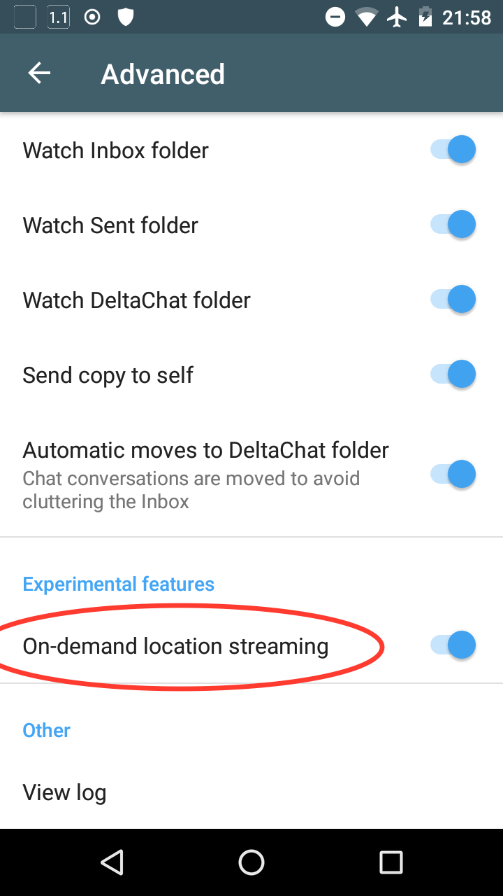
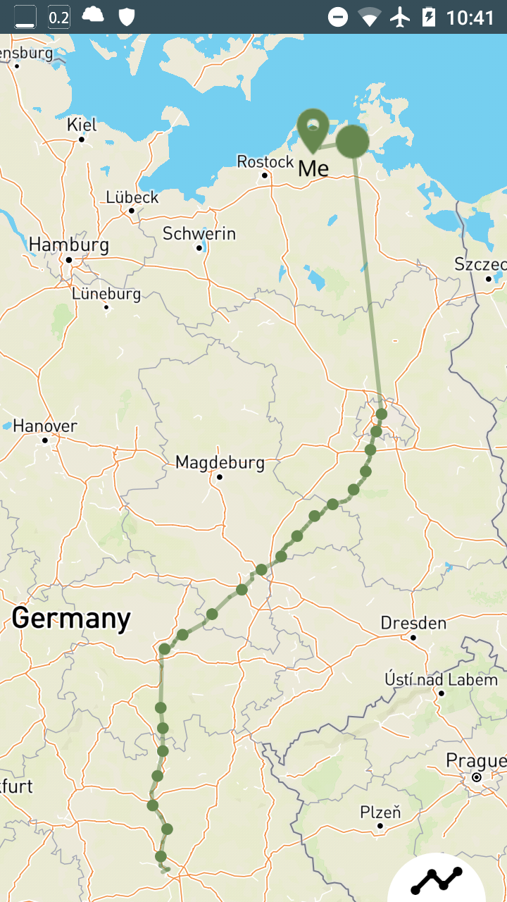
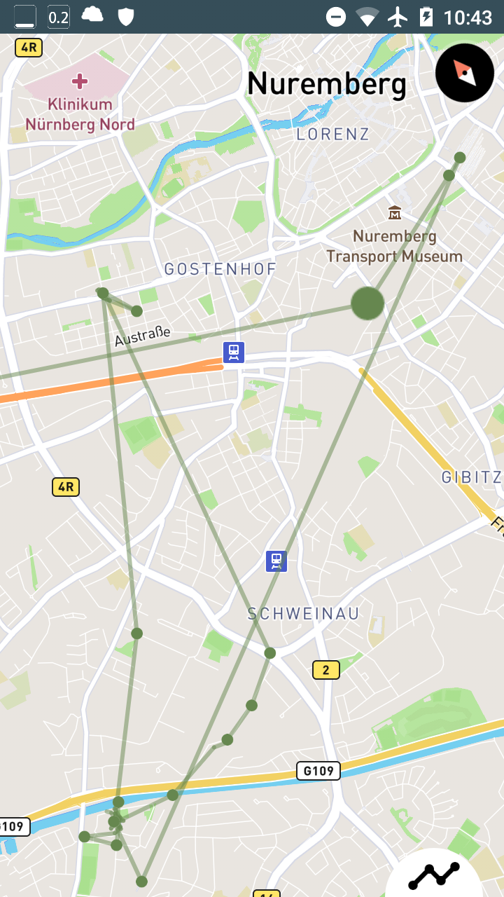

## Location DRAFT

This branch modifies the experimental location streaming feature of [Delta Chat](https://delta.chat/). It depends on [GPSLogger](https://github.com/mendhak/gpslogger/) but is fully compatible to regular Delta Chat clients.

Enable On-demand location streaming in Settings > Advanced and rename the contact to "NAME *" to make it permanently.

  

Gratefully Delta Chat allows to share positions without using Google services. I'm traveling a lot and my person of interest would like to see where I am if I'm temporary not available or if she is in doubt about I'm doing well. Since this isn't predictable I would like to share my **location permanently** with here. Contacts with name ending with ' *' will enable location streaming any time if disabled. TODO: A regular feature should implement a contact property instead of a name extension of course.

While I'm not using Google Play Services on my device `NetworkLocationProvider`s aren't available. Permanently using GPS Sensor is draining the battery very fast. [GPSLogger for Android](https://gpslogger.app/) is a **battery efficient GPS** logging application. GPSLogger is started and stopped with an Intent **managed by Delta Chat**. The `LocationBackgroundService` in Delta Chat is disabled if GPSLogger is installed on the device.

It makes no sense to monitor GPS and send a bunch of mails if you're connected with an **well known WiFi** access point so it's stopped at home for example. A Point Of Interest (POI) sent to yourself with the name of the router and suffix ' *' is used to define its location. On using such POI it will be recreated if it is older than a day to be shown on the map. TODO: Definition of WiFi Access Points needs a regular feature too.

Additionally if the device is laying on your desktop or the night table in a hotel room GPSLogger is disabled too by **detecting missing movements** of compass heading and location distances.

A lot of hours and distances I'm sitting in a German railway express called ICE. Its mirrored window surface filters GPS signals but the train provides free WiFi and a REST API with very precisely location. Connected with **"WIFIonICE"** the locations will be taken from there. TODO: This should be generic with settings to use other providers.

**Note:** Instead of registering a Service the extension hooks in the synchronization thread of Delta Chat to simplify scheduling.


## Delta Chat Android Client

This is the Android client for [Delta Chat](https://delta.chat/).
It is available on [F-Droid](https://f-droid.org/app/com.b44t.messenger) and
the [Google Play Store](https://play.google.com/store/apps/details?id=chat.delta).
The APK can also be downloaded from [GitHub](https://github.com/deltachat/deltachat-android/releases)
(only for experienced users).

For the core library and other common info, please refer to the
[Delta Chat Core Library](https://github.com/deltachat/deltachat-core-rust).

 


# Check Out Repository

When checking out _deltachat-android_, make sure also to check out the
subproject _deltachat-core-rust_:

- When using Git, you can do this initially by
  `$ git clone --recursive https://github.com/deltachat/deltachat-android`
  or later by `git submodule update --init --recursive`. If you do this in your
  home directory, this results in the folder `~/deltachat-android` which is just fine.

# Build Using Dockerfile

If you only want to build an APK, the easiest way is to use
provided `Dockerfile` with [Docker](https://www.docker.com/) or
[Podman](https://podman.io/). Podman is a drop-in replacement for Docker
that does not require root privileges.  It is used in the following
example.

First, build the image `deltachat-android` by running
```
podman build . -t deltachat-android
```

Then, run the image:
```
podman run -it -v $(pwd):/home/app -w /home/app localhost/deltachat-android
```

Within the container, build the native library first:
```
root@6012dcb974fe:/home/app# ./ndk-make.sh
```

Then, [build an APK](https://developer.android.com/studio/build/building-cmdline):
```
root@6012dcb974fe:/home/app# ./gradlew assembleDebug
```

If you don't want to use Docker or Podman, proceed to the next section.

# Install Build Environment

To setup build environment manually, you can read the `Dockerfile`
and mimic what it does.

First, you need to setup Android SDK and Android NDK.  Then, open
`ndk-make.sh` in an editor and follow the instructions to set up a rust
build environment.  This is needed only once.

After that, call `./ndk-make.sh` in the root directory to build core-rust.
Afterwards run the project in Android Studio. The project requires API 25.

With chance, that's it :) - if not, read on how to set up a proper development
environment.


# Install Development Environment

1. Some libs required by Android Studio may be missing on 64 bit Linux machines
   [Source](https://developer.android.com/studio/install.html)], so for Ubuntu execute
   `$ sudo apt-get install libc6:i386 libncurses5:i386 libstdc++6:i386 lib32z1 libbz2-1.0:i386`
   and for Fedora execute
   `$ sudo yum install zlib.i686 ncurses-libs.i686 bzip2-libs.i686`.

2. Download Android Studio from <https://developer.android.com> (android-studio-ide-...-linux.zip)
   and unpack the archive which contains a single folder called `android-studio`;
   move this folder e.g. to `~/android-studio`.

3. To launch Android Studio for the first time, open a terminal, navigate to
   `~/android-studio/bin`, execute `./studio.sh` and use all the standard values
   from the wizard.

4. Android Studio now asks you if you want to open an existing project;
   choose `~/deltachat-android` as created in the "Build" chapter (Android Studio starts to
   build the project, however, there are some steps missing before this will
   succeed).

5. If components are missing, click on the corresponding error
   message and install eg. required SDKs and the "Build-Tools" (you should
   also find the option at "Tools / Android / SDK Manager / SDK Platforms").
   Now the build should succeed - but the app still misses the native part.

6. Download Android NDK from
   [NDK Archives](https://developer.android.com/ndk/downloads)
   and extract the archive containing a single folder
   called `android-ndk-r…`; move this folder e.g. to `~/android-ndk-r…`.

7. Export the folder path to your environment as `ANDROID_NDK` and add it to `PATH`.
   You can achieve this e.g. by adding the following lines to `.bashrc`
   `export ANDROID_NDK=/home/USERNAME/android-ndk-r…`
   `export PATH=$PATH:$ANDROID_NDK`.


# Credits

The user interface classes are based on the Signal messenger.


# License

Licensed GPLv3+, see the LICENSE file for details.

Copyright © 2020 Delta Chat contributors.
